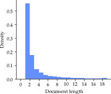
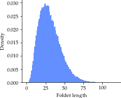
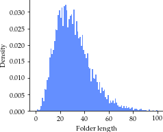
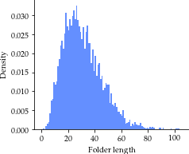

# Tab this Folder of Documents: Page Stream Segmentation of Business Documents
### Get our repository
```
git clone git@github.com:aldolipani/TABME.git
cd TABME
```
### Citation
```
@inproceedings{mungmeeprued-etal-2022-tab-this,
title = {Tab this Folder of Documents: Page Stream Segmentation of Business Documents},
author = {Thisanaporn Mungmeeprued and Yuxin Ma and Nisarg Mehta and Aldo Lipani},
year = {2022},
booktitle = {Proceedings of the ACM Symposium on Document Engineering},
publisher = {ACM},
address = {San Jose, CA, USA},
series = {DocEng '22},
}
```

## The TABME Dataset

The dataset consists of a set of preprocessed pdfs documents which have been converted into
a folder of images with associated ocr output and a file containing the information about how
to create the folders of documents. Each line of this file contains the id of the document to concatenate and 
the folder id. This dataset is split into train, validation and test sets. Each split has a folder with
the documents and a file of information. The training set contains 10,000 folders, 
the test set contains 1,000 folders and the validation set contains 1,000 folders. 
These folders have been generated based on a Poisson distribution with $\lambda$ = 11.

### Get our Preprocessed Dataset
```
bash ./data/download_dataset.sh
```

### *Preprocess the Raw Data (Not Required)*
If you want to use the same dataset used in the paper, 
you don't need to perform these instructions and just use the one already made in the repository.

#### Requirements

To preprocess the pdfs you need to install imagemagick and parallel. 
For linux users, run 
``` 
sudo apt-get install imagemagick parallel
```

Following the instructions used to create the dataset. 

1. Download the pdfs from the source using `./get_raw_data.sh`
2. Preprocess the pdfs using `./preprocess_pdfs.sh`


### Data Statistics
#### Training Set


#### Validation Set


#### Test Set



Visualisation in more detail can be found in `./notebooks/visualise_data.ipynb`

### Our Model
#### Dependencies
1. Install [miniconda](https://conda.io/projects/conda/en/latest/user-guide/install/) to set up the environment.

2. Create and activate environment from the provided file environment.yml.
    ```
    conda env create --file environment.yml
    conda activate tabme
    pip install -r requirements.txt
    ```
    You might need to install the specific version of Torch separately if you use CUDA. For example, for the CUDA 11.1 that we used,
    ```
    pip install torch==1.9.0+cu111 torchvision==0.10.0+cu111 -f https://download.pytorch.org/whl/torch_stable.html
    ```
    
    and deactivate ```conda deactivate``` after use.

3. Clone our repository and set the current folder to our repository `TABME`.

### Our Setup
* Ubuntu 18.04.5 LTS
* Nvidia GeForce RTX 3090 GPU
* CUDA 11.1

## Get the Model Weights
Run the script `output/model_weights/download_model.sh` to obtain the model weights. Models can be found in
* Full model : `output/model_weights/20220720-203907_l_5e-05_n_5_a_None`
* With ResNet ablation : `output/model_weights/20220723-161557_l_5e-05_n_5_a_resnet`
* With LayoutLM ablation : `output/model_weights/20220723-203446_l_5e-05_n_5_a_layoutlm`

## *Hyperparameter Tuning (Not Required)*
We use grid search to obtain the optimal values of learning rate and number of 1D-convolutional layers. To reproduce our process, use the command

```
python3 validation.py data/train data/val --lr 5e-5 --num_hidden_layers 0 1 2 3 4 5 6
```
The values of learning rate and number of 1D-convolutional layers used in the tuning can be adjusted by changing the argument --lr and --num_hidden_layers respectively.

In our case, the models were trained in all possible combinations between learning rates of 5e-5 and numbers of hidden layers of 0, 1, 2, 3, 4, 5, and 6 (thus, 1x6 = 6 runs). By default, the validation losses for all combinations are stored with the file format `./output/results_<TIME_STAMP>.csv`. 

For more information, enter `./validation.py -h` in the terminal.

Our hyperparameter tuning result is provided in the file `./output/results_summary.csv` which shows the minimum loss and the maximum F1 over 5 repeats for each setting of hyperparameter.

## Model Training 
To train the model with the optimal hyperparameters obtained from hyperparameter tuning, use the script `./run.py`. 

```
python3 ./run.py data/train data/val
```
### Ablation Study (RQ2)
To perform the ResNet and LayoutLM ablation, 
```
python3 ./run.py data/train data/val --ablation layoutlm
python3 ./run.py data/train data/val --ablation resnet
```
### *Customise Training (Not Required)*
To train the model at the specific learning rate and number of hidden layers, for example, the learning rate of 1e-4 and the number of hidden layers of 3, use the command.

```
python3 ./run.py data/train data/val --lr 1e-4 --num_hidden_layers 3
```

By default, the model weight, log and config files are saved in a folder within `./output`.

For more information, enter `python3 ./run.py -h` in the terminal.

## Test the Model
### *Generate Folders and Store in the .csv file  (Not Required)*
The .csv files indicating folder separation are generated to facilitate the evaluation from the notebook `notebooks/generate csv file.ipynb`. The resulted files is provided in `predictions/test.csv` for our test set and in `predictions/tobacco800.csv` for the baseline Tobacco800 dataset.

### Obtaining Predictions and Evaluation Matrices
The predictions of the test set by the unablated model is generated and stored in the file `predictions/full_model_predictions_test.csv`
```
python3 ./predict.py --data data/test --model output/model_weights/<TIME_STAMP>_l_5e-05_n_5_none --csv ./predictions/test.csv
```
Different folders are input in the argument --model in case of the Resnet and the Layoutlm ablation.

Evaluation matrices (namely F1, Precision, Recall, Minimum Number of Drags-and-Drops), as well as comparison to baselines, are calculated and visualised in the notebook `notebooks/evalutations.ipynb`. The performance of our model on the test data is found in `notebooks/full_model_performance.csv`.

Various results and diagrams of our experiments are found in the folder `notebooks`.

